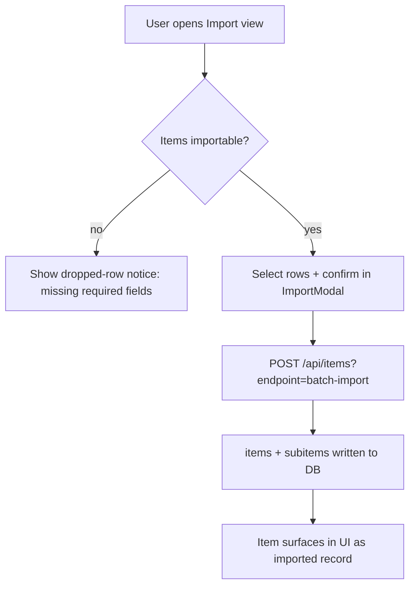

# Write Plan

Create a structured implementation plan that can be executed by subagents or followed step-by-step. Plans live in `docs/plans/` and serve as the contract for what gets built.

## Arguments

- First argument (optional): Feature name
- If coming from `/research-gate`, use the approved approach as input

## Prerequisites

- `/research-gate` should have run first (constraints and approach already decided)
- If not, ask: "Should I run /research-gate first, or do you already know the approach?"

## Plan Document Structure

Create `docs/plans/YYYY-MM-DD-{feature-slug}.md`:

```markdown
# [Feature Name] Implementation Plan

**Goal:** [One sentence — what does "done" look like?]
**Done When:**
- [ ] [Behavioral: "When [user action], [expected result]"]
- [ ] [Data: "[Field] shows [value] for [condition]"]
- [ ] [Visual: "[Component] renders [correctly / matches existing pattern]"]
- [ ] Build passes all affected projects
- [ ] No lint errors

These criteria are verified by `/review-impl` Agent A (Spec Compliance) and Phase 4 (Playwright Visual Verification).

**Approach:** [2-3 sentences — the chosen approach from research gate]
**Constraints:** [Key constraints that shaped this approach]

## File Map

| Action | File | Lines |
|--------|------|-------|
| Create | `project/src/components/NewView.jsx` | — |
| Modify | `project/src/App.jsx` | 45-60 |
| Modify | `shared/utils.js` | append |

## User Flow (optional — include only for features with a multi-screen / multi-step user journey)

A mermaid `flowchart` of the path the user takes through the feature. Drop it in the plan and hand it to the coding agent so the screens, branches, and decision points are explicit *before* any are built — cheaper than discovering a missing branch in Task 4. **Skip** for API-only, single-screen, cosmetic, or read-only features (a diagram of one screen is noise).



## Task 1: [Component/Feature Name]

**Files:** `exact/path.js`, `exact/other.js`
**Estimated scope:** [S/M/L — S = 1-2 files, M = 3-5 files, L = 5+]

- [ ] Step 1: [Specific action with complete code or exact description]
  ```jsx
  // Complete code block — not "add validation" but the actual code
  ```
- [ ] Step 2: [Next action]
- [ ] Verify: [Exact verification command or check]
  ```bash
  cd project && npm run build  # must pass
  ```

## Task 2: [Next Component]
...

## Task N: Final Verification

- [ ] Build all affected projects: `cd project && npm run build`
- [ ] Lint passes: `cd project && npm run lint`
- [ ] Manual smoke test: [what to check in browser]
- [ ] Playwright verification: [if applicable]

## Agent Orchestration Spec

[Dependency graph]
Task 1 ──→ Task 3 ──→ Task 5 (verify)
Task 2 ──→ Task 4 ──╱

### File-ownership map
| Hot file (touched by 2+ tasks) | Tasks | Owning agent | Stage |
|--------------------------------|-------|--------------|-------|
| `path/to/BigComponent.jsx`     | 1,4,6 | C3 then D2   | C / D |

### Stages (fan-out / fan-in)
| Stage | Agents (parallel) | Model | Isolation | Gates on |
|-------|-------------------|-------|-----------|----------|
| 0     | S0 schema/migration | opus | worktree | — |
| C     | C1 ∥ C2 ∥ C3 (file-disjoint) | opus/sonnet | worktree | Stage 0 merged |
| D     | D1 ∥ D2 | sonnet | worktree | Stage C merged |
| E     | E1 tests ∥ E2 review | sonnet/opus | worktree/none | Stage D merged |

Merge order + guardrails: [base-SHA per stage, /worktree-guard before copy, commit-before-report]
```

## Vertical Slicing (MANDATORY)

**Each task/phase must deliver a testable end-to-end increment.** Never write phases like "all the backend first, then all the UI" — that produces plans where you can't verify anything until the last task lands.

**Vertical slice** (good):
- Task 1: "Add POST /api/items endpoint + one React form field + persist to DB + verify curl returns 200 and field renders"
- Task 2: "Add GET /api/items?id=X + detail view in UI + verify round-trip"
- Task 3: "Add delete + optimistic UI removal + verify"

**Horizontal slice** (bad — avoid):
- Task 1: "Build all 4 API endpoints"
- Task 2: "Build all the DB schema"
- Task 3: "Build the React components"
- Task 4: "Wire them together"

**Why**: horizontal slices stack risk at the end — the first 3 tasks "pass" but nothing actually works until Task 4. If Task 4 surfaces a design flaw, you redo all the earlier work. Vertical slices force integration issues to appear in Task 1 when they're cheap.

**Exception**: schema migrations that multiple tasks depend on can be a standalone Task 0. That's the only horizontal slice allowed.

## Plan Quality Checklist

Before presenting the plan to the user, verify:

- [ ] **Every step has exact file paths** — no "update the relevant file"
- [ ] **Code blocks are complete** — not "add error handling" but the actual try/catch
- [ ] **Each task is independently verifiable** — has a verify step
- [ ] **Scope per task is S or M** — break L tasks into smaller pieces
- [ ] **Every phase is a vertical slice** — each one produces a testable end-to-end increment (see Vertical Slicing section above). No "all backend then all UI" plans.
- [ ] **User-flow diagram included for multi-screen features** — optional, but for any feature with a multi-step user journey, add the mermaid `flowchart` (see Plan Document Structure) so the screens/branches are explicit before building. Skip for API-only / single-screen / cosmetic work.
- [ ] **Agent Orchestration Spec present** — every plan with 3+ tasks has the orchestration section: file-ownership map, stages, agent assignments, merge order. See section below — this is MANDATORY, not optional.
- [ ] **Constraints from research gate are respected** — no approach that was already eliminated
- [ ] **"Always/Ask/Never" boundaries carried over** — if research-gate produced implementation boundaries, they're referenced or restated at the top of the plan
- [ ] **Existing patterns followed** — uses shared utilities, matches codebase conventions
- [ ] **Behavioral "Done When" criteria** — each task has at least one testable assertion (not just "build passes")
- [ ] **Security considered** — auth checks, input validation, CORS for new endpoints
- [ ] **State / timing / race audit done** — see section below. Skip only for pure read-only or cosmetic features.

## State / Timing / Race Audit (MANDATORY for stateful features)

Any feature that writes to a database, cache store, or shared state (e.g. a pending-changes map), or that triggers a refresh cycle, must pass this audit before the plan is approved. Silent races here have cost hours repeatedly. Explicitly address each row that applies — don't skip rows with "probably fine":

| Hazard | What to check |
|---|---|
| **Stale `useMemo` after state setter** | If the plan calls a handler right after `setX`, will it read the pre-update memo? Solution: `pendingAction` flag + `useEffect`, or accept the staleness explicitly. |
| **Cache invalidation after DB writes** | Does the write need to invalidate specific cache keys? Are there keys that must NOT be deleted because enrichment runs at read-time? |
| **Query invalidation coverage** | Does `handleRefresh` (or equivalent) invalidate ALL data keys that depend on the mutated table? Missing any key causes stale renders. |
| **Override confirmation** | If confirming a pending state, compare ALL identifying fields — not just one. Prefer server `result` over local data-driven string matching. |
| **Safety timers** | Never blind-clear pending state on a timer — must only clean up drafts + release refs. |
| **Re-entrancy / double-click** | Can the user click twice before state settles? Disable the triggering control while a pending flag is set. |
| **Effect re-fire during pipeline churn** | Effects watching state that the submit pipeline also mutates need a guard (`if (modalOpen) return` or equivalent). |
| **Chunk boundary collisions** | If chunked writes seed an index from `SELECT MAX(...)` server-side, ensure concurrent writes can't collide. |
| **Draft autosave collisions** | New flows that mutate shared state should debounce with AbortController — don't duplicate if a shared pattern already exists. |
| **Auth / identity** | Service-token requests need fallback identity; PIN gate is independent. Test both authed identities if your project has multiple auth paths. |
| **DST / cron triggers** | Worker crons are UTC — season changes shift fire times. A deploy command may NOT remove registered crons; verify via API after deploy. |
| **Secret-deploy-secret drift** | Rotating a secret via CLI can create deployments with OLD code — always follow with a full redeploy. |

**How to use this:** In the plan document, add a short "State / Timing / Race audit" subsection that names each hazard that applies and the mitigation, or explicitly notes "N/A — feature is UI-local / read-only". Reviewers check this section exists.

## Agent Orchestration Spec (MANDATORY for 3+ task plans)

**Every plan with 3 or more tasks MUST include an Agent Orchestration Spec.** Planning and
orchestration are not separate activities — a plan that doesn't say *how it gets executed by
agents* is half a plan. Do not defer this to "later" or "if the user wants parallelism." Design
the orchestration as part of the plan, every time.

A bare dependency graph ("Task 1 → Task 3") is NOT an orchestration spec. The spec must answer:
*which agent owns which files, in what stage, and in what merge order.*

### Step 1 — Build the file-ownership map (the conflict-avoidance contract)

List every file touched by **2 or more tasks**. Two worktree agents editing the same file =
guaranteed merge conflict. So each hot file is assigned to **exactly one agent per stage**, and
the tasks that touch it are either given to that one agent or split across serialized stages.
Hot files (large shared components, central API routers, `shared/*`) are the binding constraint
on how wide you can fan out — identify them first, then design stages around them.

### Step 2 — Group tasks into stages (fan-out / fan-in)

Apply cascade-orchestration **Pattern 2 (Sequential Pipeline) + Pattern 1 (Fan-Out/Fan-In)**:

- **Stage 0** — schema/migration or any other true blocker. Single-threaded or one agent. The
  only allowed horizontal slice. Everything downstream gates on it.
- **Stage C (and beyond)** — fan out parallel agents whose file sets are **disjoint**. Agents
  that would touch the same hot file go in *different* stages, not the same one.
- **Final stage** — verification: tests, `/review-impl`, build, visual check. Always last.

Within a stage, every agent: `isolation: "worktree"`, branches from the **same pinned base SHA**,
builds its project, and **commits before reporting**.

### Step 3 — Assign agents, models, and merge order

For each agent specify: id, role, model (`sonnet` floor for routine; `opus` for schema, API
contracts, security, review — per `/model-selection`), `isolation`, the explicit disjoint file
list it owns, and which tasks it covers. Then state the merge order and the fan-in steps
(`/worktree-guard` before each copy, build, verify "Done When").

### Orchestration guardrails (always restate in the plan)

- **Base-SHA discipline** — every agent in a stage branches from the same SHA; pass the literal
  SHA in each agent prompt (concurrent pushes lag the worktree base).
- **Commit-before-report** — verify with `git -C <worktree> log`; empty diff = agent failed.
- **/worktree-guard before every copy** — never `cp` a worktree file without the conflict diff.
- **No cross-stage parallelism** — later-stage agents edit earlier-stage-owned files.
- **Max depth 2** — orchestrated agents do not spawn sub-agents.
- **Code-modifying agents MUST use `isolation: "worktree"`** (prevents the class of incident where a subagent modifies live/production files).

### When the plan is small

For a 3-task plan with no hot-file overlap the spec can be three lines (one stage, three
disjoint agents, merge in any order). It is still required — brevity is fine, omission is not.
A genuinely sequential plan (each task depends on the last) states that explicitly: "single
chain, no fan-out — Stage A → B → C, one agent each or main-thread sequential."

## Execution Modes

After the user approves the plan, execute the Agent Orchestration Spec above. The spec already
defines the stages and agents — these modes are just how tightly you follow it:

### Mode A: Full orchestration (default for 3+ tasks)

Execute the Orchestration Spec stage by stage: dispatch each stage's agents in parallel (single
message, multiple Agent calls, `isolation: "worktree"`), fan in with `/worktree-guard` + merge +
build, then proceed to the next stage. This is the default — the spec was designed for it.

### Mode B: Sequential Execution (genuinely dependent tasks or <3 tasks)

Execute tasks sequentially with TodoWrite tracking. Use only when the Orchestration Spec itself
concluded "single chain, no fan-out."

### Mode C: Hybrid

Some stages fan out, some are single-threaded (e.g. Stage 0 schema). This is what most
multi-stage specs already describe — just follow the spec.

## Plan Maintenance

A plan doc is a **living surface**, not a write-once artifact, for any feature that spans more than one session:

- **Re-read it to recover scope** at the start of each session on that track — the plan is the fastest way back into context, faster than re-deriving from code or git history.
- **Edit it progressively** as work resolves, gates clear, and decisions land — check off tasks with [x], record what shipped, park open questions inline.
- **Fork a new dated doc** when a distinct sub-track emerges, rather than overloading one file (`YYYY-MM-DD-<topic>.md` + `YYYY-MM-DD-<topic>-phase2.md`). Cross-link them.
- **Keep it in sync with any other tracking surface** for the same work (a project-status board, a memory file) — the plan doc is the detailed record; drift between them is the failure mode.
- **Update the plan** if the approach changes during implementation.
- **Add discovered tasks** that weren't in the original plan (scope creep flag — ask user first).
- Plans are reference documents, not sacred — adapt if reality diverges.

### Before designing a shared core across parallel worktrees

When a plan unifies two implementations that live in separate branches/worktrees, **read BOTH implementations by their actual current state first** — do not design the shared/convergence core from one side plus assumptions about the other. Confirm each file exists on its branch before writing the convergence spec; a plan built on an assumed second implementation drifts immediately once you actually read it.

## When NOT to Write a Plan

- Single-file bug fixes
- CSS-only changes
- Config/secret updates
- Features that `/research-gate` cleared as "no blocking constraints, straightforward"
- Tasks with fewer than 3 steps

For these, just use TodoWrite directly.
